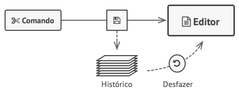
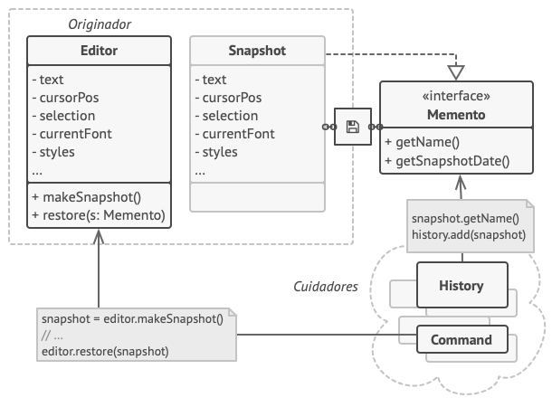

# O que é

é um padrão de projeto do grupo dos comportamentais, Memento do latim significa algo como lembre-se, ou recordar, o que é basicamente p que este padrão faz, que é salvar em um histórico, ou lembrar-se, do estado anterior de um objeto, mas sem revelar em detalhes sua implementação.

## Problema

O que eu mais encontrei pesquisando, foi o exemplo de um editor de textos moderno, pois todos os usuários, esperam poder "dar ctrl + z" para poder desfazer qualquer tipo de alteração antes feita, poderíamos simplesmente armazenar todos os estados dos elementos em tela antes de realizar alguma alteração, e depois usar este esteado antigo caso o usuário queira, mas esta abordagem não se torna tão simples ao trabalhar com POO, pelo fato de que os objetos muitas vezes tem diversos atributos e muitos deles são privados, ou seja, outras classes não podem acessar.



Uma solução seria evitar o uso de atributos privados, mas isso vai contra o principio de encapsulamento, um dos quatro pilares da POO, além que, ao resolver desta forma, um classe estaria literalmente copiando outra, fazendo ter muito repetição de código, e tornando uma futura refatoração muito complexa.

## Solução

O padrão `Memento` implementa uma forma mais "POO" de fazer as coisas, onde, ao invés de tentarmos armazenar o estado da classe original (no exemplo, um editor de texto) em outra classe talvez nomeada de histórico, armazenar estas informações dentro de um objeto especial chamado memento dentro da própria classe que necessita de um histórico, pois desta forma, ela teria acesso total a seus estados, inclusive, desta forma, o próprio "histórico" poderia estar encapsulado dentro da classe que irá usa-lo, assim limitando o acesso destas informações por outras classes.



# Código

Este exemplo de código usa os exemplos já citados de um editor de texto, ele está bem simplificado, então não armazena coisas como a formatação, onde o cursor está entre outras coisas que seriam usadas no mundo real, só armazena o texto do editor para melhor compreensão

- Classe Memento, que será a classe do objeto memento dentro de outra class:

```java
package MementoExample;

public class Memento {
	private final String state;

  public Memento(String state) {
    this.state = state;
  }

  public String getState() {
    return state;
  }
}
```

- Classe Original, no caso um editor de texto, que usará a classe Memento:

```java
package MementoExample;

public class TextEditor {
  private String text;

  public void setText(String text) {
    this.text = text;
  }

  public String getText() {
    return this.text;
  }

  public Memento save() {
    return new Memento(text);
  }

  public void restore(Memento memento) {
    this.text = memento.getState();
  }
}
```

- Classe CareTaker, no caso histórico, que armazena uma `Pilha` de Mementos:

```java
package MementoExample;

import java.util.Stack;

public class History {
  private final Stack<Memento> history = new Stack<>();

  public void saveState(TextEditor editor) {
    history.push(editor.save());
  }

  public void undo(TextEditor editor) {
    if (!history.isEmpty()) {
      editor.restore(history.pop());
    }
  }
}
```

- Main Class:

```java
package MementoExample;

public class Main {
  public static void main(String[] args) {
    TextEditor editor = new TextEditor();
    History history = new History();

    editor.setText("Hello, world!");
    history.saveState(editor);
    System.out.println("Texto atual: " + editor.getText());

    editor.setText("Novo texto...");
    System.out.println("Texto modificado: " + editor.getText());

    history.undo(editor);
    System.out.println("Após desfazer: " + editor.getText());
  }
}
```